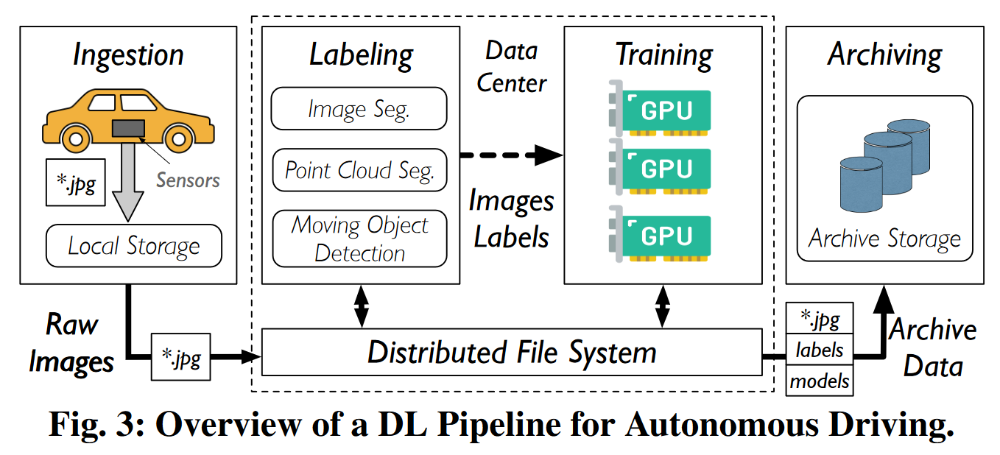
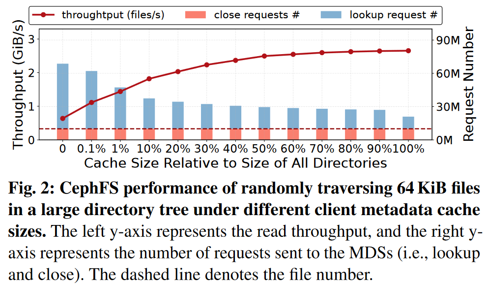
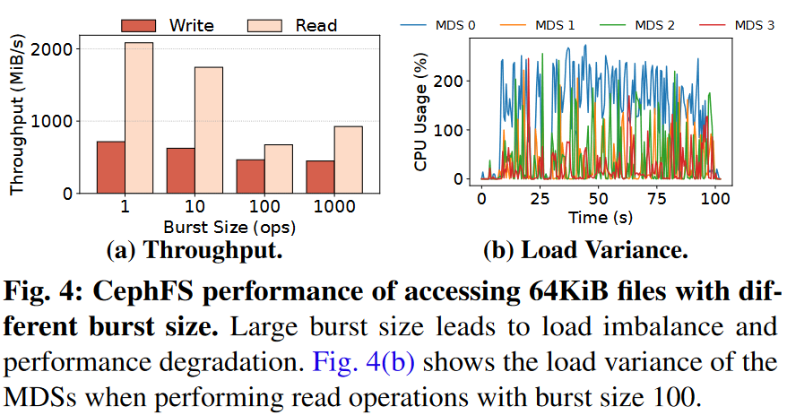
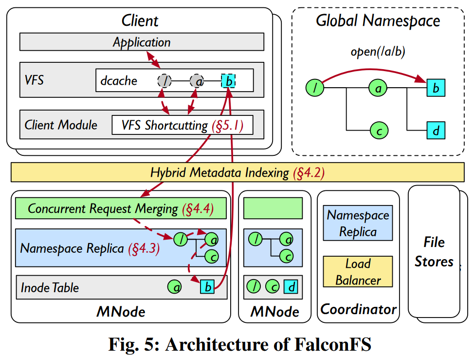
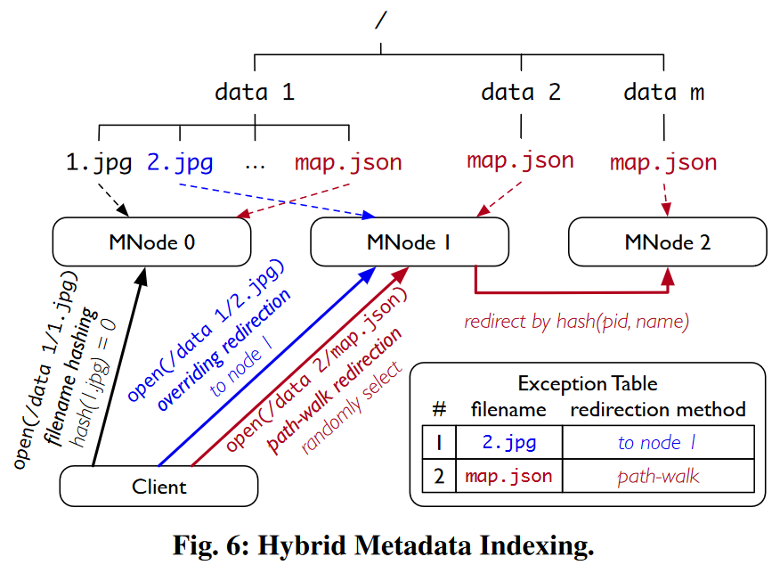
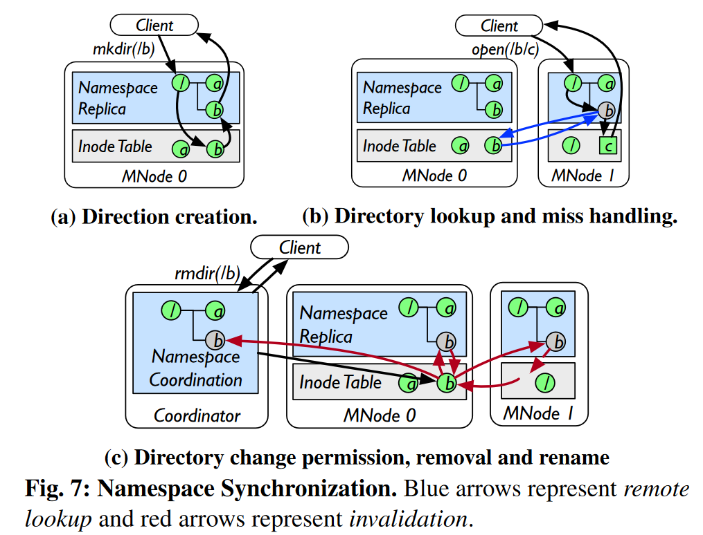
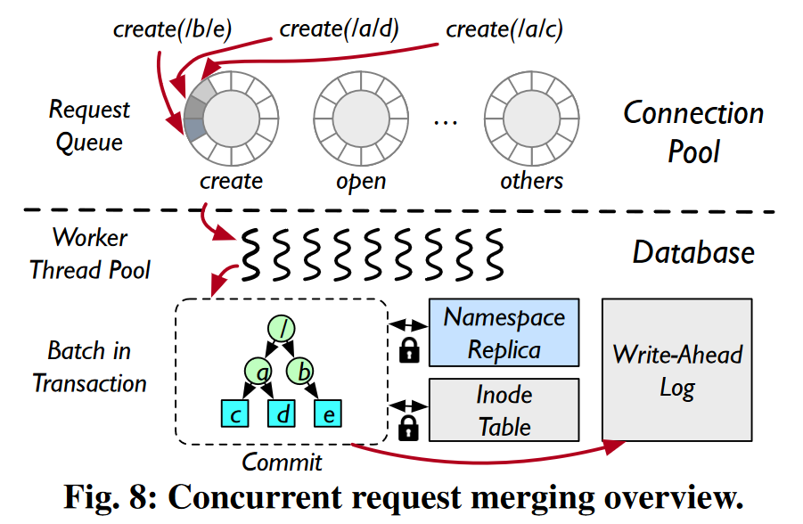
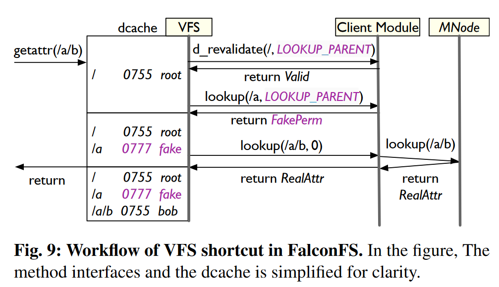
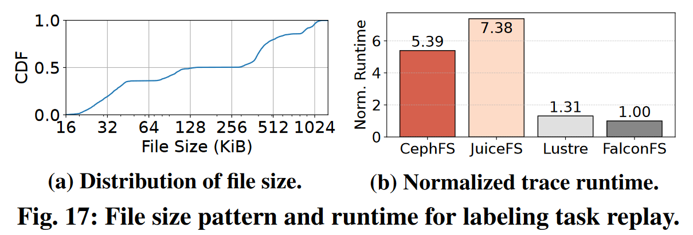
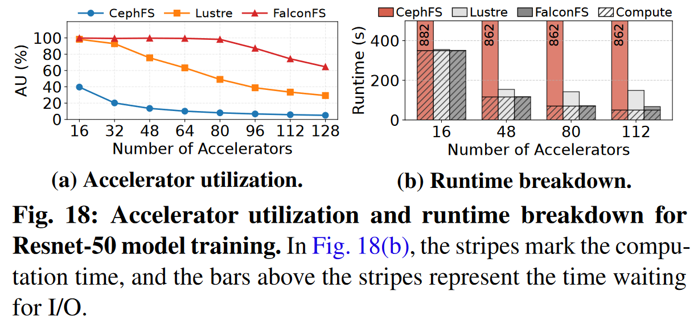

> Xu J, Kang J, Dong M, et al. **FalconFS: Distributed File System for Large-Scale Deep Learning Pipeline**[C]//23rd USENIX Symposium on Networked Systems Design and Implementation. 2026: xx-xx. 

### 问题

在深度学习流水线中，分布式文件系统的客户端元数据缓存是无效的，浪费了宝贵的内存资源。

* **挑战一**：元数据查询开销
  * 在分布式文件系统（DFS）中，目录元数据通常分散存储在多个元数据服务器中。在路径解析时，DFS会出现**请求放大（request amplification）**的问题，即一个文件元数据操作需要发起多次网络请求。为了降低路径解析开销，DFS采用了客户端元数据缓存。
  * 在每轮训练中，训练任务会随机遍历数据集中的文件，且每个文件只会被访问一次。
  * 因此，训练任务对缓存大小非常敏感：缓存较小时，缓存不命中会增加查询请求，导致请求放大，降低读取性能；而缓存大量元数据则需要占用大量客户端内存。在VFS中，缓存一个目录的元数据需要800 Byte，其中，inode需要608 Byte，dentry需要192 Byte。

* **挑战二**：元数据访问倾斜
  * CephFS等DFS采用了基于子树划分的元数据管理方法，通常会将同一目录下的文件元数据存储在一起。
  * 在标注阶段中，推理任务会依次扫描每个目录，并访问目录中的所有文件。
  * 因此，这种逐目录的I/O模式会造成临时的元数据访问倾斜。

### 方法

作者提出了**无状态的客户端架构（stateless-client architecture,）**，将路径解析迁移到服务端中。

#### 混合元数据索引

**方法**：利用文件名哈希，将文件inode放置到对应的元数据服务器上，并使用选择性重定向来实现负载均衡。

（1）正常情况：使用文件名哈希来定位元数据服务器。

（2）极端情况：

第一，**热门文件名（Hot filenames）**：由于应用程序的命名惯例，特定文件名会频繁出现，例如，图6中的`map.json`；

第二，**哈希方差（Hash variance）**：如果唯一文件名的数量没有远多于元数据服务器的数量，文件名将会分布不均衡。

解决办法：选择性重定向（selective redirection)，并使用异常表（exception table）来指定哪些文件名如何重定向。

* 针对热门文件名的**路径游走重定向（path-walk redirection）**：客户端随机选择一个MNode发送请求，接收节点同时使用父目录ID和文件名执行哈希操作`hash(pid, name)`，将请求重定向到目标节点上。

* 针对哈希方差的**重写重定向（Overriding redirection）**：FalconFS将文件名重新分配到指定的节点中，从而将负载从过载节点迁移到负载较轻的节点中。

#### 延迟命名空间复制

**方法**：在所有元数据服务器上复制整个命名空间，并采用**延迟同步**和**无效机制**来降低维护开销。

* **创建目录**：在mkdir执行成功后，MNode不会主动向其他MNode广播新的dentry。在查询本地命名空间副本时，如果发现了缺失的dentry，其他MNode会根据混合元数据索引来计算负责该dentry的MNode，并从中获取dentry的信息。
* **删除目录**：客户端将`rmdir(/b)`请求发送给Coordinator。Coordinator先获取所有祖先目录的共享锁和目标目录的互斥锁，然后将请求转发给该目录的所有者（`MNode 0`）。MNode 0先对`/b`上锁以阻塞后续的lookup请求，并向其他MNode广播一个无效请求。收到请求后，每个MNode无效化本地的相应dentry，并搜索inode表，查询该目录的孩子，并向MNode 0返回是否存在孩子。MNode 0则负责聚合这些响应信息。若没有孩子，MNode 0会删除对应的inode，并通知Coordinator。而Coordinator则会释放所有的锁，并回应客户端。否则，MNode 0返回`-ENOTEMPTY`，终止rmdir操作。

#### 并发请求合并

每个元数据服务器会初始化固定数量的数据库工作线程，并准备好一个连接池。根据请求类型不同，连接池会将请求放到对应的请求队列中。空闲工作线程检索队列，并在一次事务中执行队列中的所有请求。

* **锁合并**：工作者线程以批次为粒度来组合锁获取和释放操作。图8中有三个`create`操作，每个操作需要遍历2个目录和1个文件。单独执行这些操作需要获取9次锁，而消除冗余锁获取后，FalconFS只需要获取6次锁（`/`、`b`、`e`、`a`、`d`、`c`）。
* **预写日志合并**：由于多个操作可以在一次事务中批量执行，工作者线程可以将多个小的日志追加操作合并为一个更大的日志追加操作。

#### VFS Shortcut

* **方法**：当VFS对中间目录执行lookup操作时，VFS shortcut将会返回假的目录属性（带有特殊的uid和gid，权限为0777），以通过VFS检查。而当VFS对路径的最后部分执行lookup操作时，客户端模块则将完整的路径发送给元数据服务器，由元数据服务器执行实际的路径解析等操作。

* **区分中间路径和最后路径的查询请求**：从Linux 5.7开始，在路径游走时，VFS会设置状态位`LOOKUP_PARENT`，并将其传递给lookup()方法，用以表明尚未到达路径的最后部分。如果设置了该状态位，客户端模块则知道该查询是针对中间目录的，从而返回假属性。

* **避免暴露假属性**：当dcache命中时，VFS会调用`d_revalidate()`方法来验证缓存项，而客户端模块则根据uid和gid来判断命中项是否为假属性。

### 实验

对比系统：CephFS、JuiceFS、Lustre

测试工具：

* 端到端性能测试
  * 标注任务：华为标注集群trace
  * 训练任务：MLPerf Storage Benchmark (ResNet-50)

* 实验结果

### 总结

与CephFS和Lustre相比，FalconFS的小文件读写吞吐量最高提升了5.72倍，模型训练的吞吐量最高提升了12.81倍。

代码仓库：https://github.com/falcon-infra/falconfs

### 启发

* 不妨否定前人的假设，推翻原有的框架，看看能否有新的机遇。

### 不足

* 深度学习训练/推理任务不仅有元数据/数据读取操作，还有许多元数据/数据写入操作，例如，KV缓存/模型参数卸载、检查点写入等。针对这些写入操作，DFS能否提供一些针对性的优化呢？
